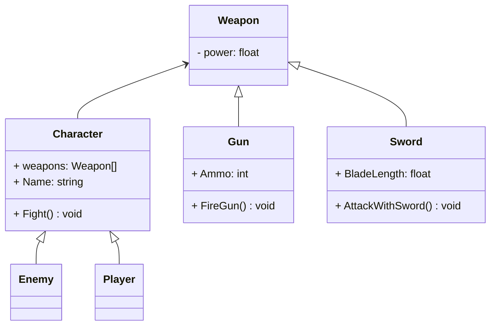

```mermaid
classDiagram

    class Character{
        + weapons: Weapon[]
        + Name: string

        + Fight() void
    }

    class Enemy{

    }

    class Gun{
        + Ammo: int

        + FireGun() void
    }

    class Player{

    }

    class Sword{
        + BladeLength: float

        + AttackWithSword() void
    }

    class Weapon{
        - power: float
    }


    Character <|-- Enemy
    Character <|-- Player

    Weapon <|-- Gun
    Weapon <|-- Sword

    Weapon <-- Character
```